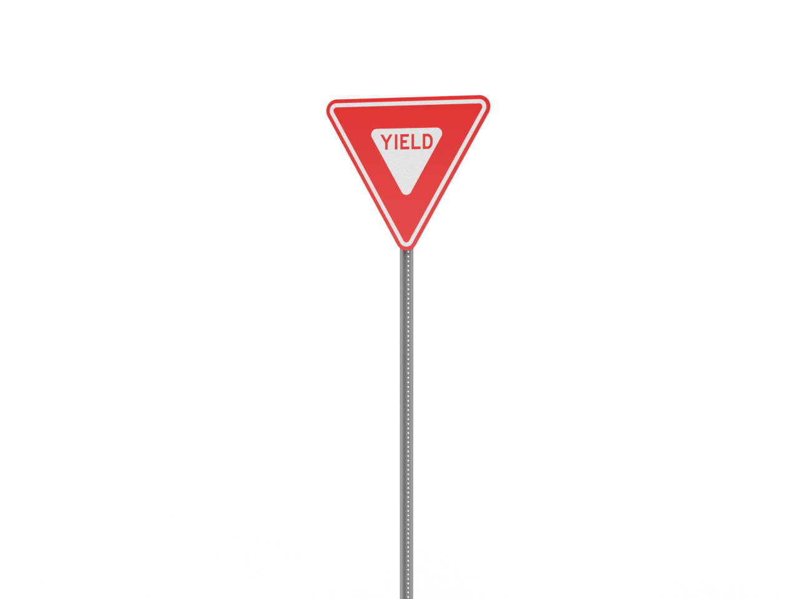
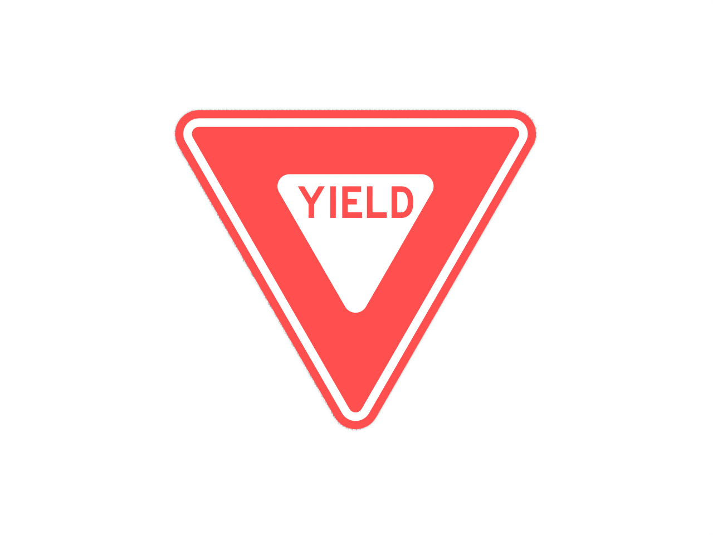

# Signage

Urban asset for signage applications in city planning and simulation.

## Preview


*Additional views:*



## Specifications

- **Scale**: 1:48 (HO Scale)
- **Material**: Designed for PLA/PETG 3D printing
- **Print Time**: Varies by complexity
- **Support Required**: Minimal (model optimized for printing)

## Files Available

| File | Format | Description |
|------|---------|-------------|
| `Stop Sign red.stl` | STL | 3D printable mesh file |
| `Stop Sign white.stl` | STL | 3D printable mesh file |
| `Stop Sign with pole.stl` | STL | 3D printable mesh file |
| `Stop Sign.stl` | STL | 3D printable mesh file |
| `truck crossing sign only.stl` | STL | 3D printable mesh file |
| `truck crossing sign.stl` | STL | 3D printable mesh file |
| `Yield Sign red.stl` | STL | 3D printable mesh file |
| `Yield Sign white.stl` | STL | 3D printable mesh file |
| `Yield Sign.stl` | STL | 3D printable mesh file |
| `stopsign.png` | PNG | Preview image |
| `yield sign 1.png` | PNG | Preview image |
| `yield sign.png` | PNG | Preview image |

## Usage

### 3D Printing
- **Layer Height**: 0.2mm (0.15mm for fine details)
- **Infill**: 15-20% (adjust based on use case)
- **Print Speed**: 50-60 mm/s
- **Supports**: Usually not required

### Applications
- Urban planning models
- Architectural visualizations
- City planning presentations
- 3D printed scale models
- Traffic flow simulations
- Road safety analysis
- Driver training scenarios

## Download

- [Download STL file](Stop Sign red.stl)
- [Download STL file](Stop Sign white.stl)
- [Download STL file](Stop Sign with pole.stl)
- [Download STL file](Stop Sign.stl)
- [Download STL file](truck crossing sign only.stl)
- [Download STL file](truck crossing sign.stl)
- [Download STL file](Yield Sign red.stl)
- [Download STL file](Yield Sign white.stl)
- [Download STL file](Yield Sign.stl)

## Attribution

When using this asset, please cite:
```
Author: Henry Levesque
Source: Urban Asset Library - Signage
URL: https://github.com/hleve/Urban_Asset_Library
```

## Related Assets

- [All Urban Assets](../)
---

*Part of the [Urban Asset Library](../../../) - Open source urban assets for simulation and 3D printing*