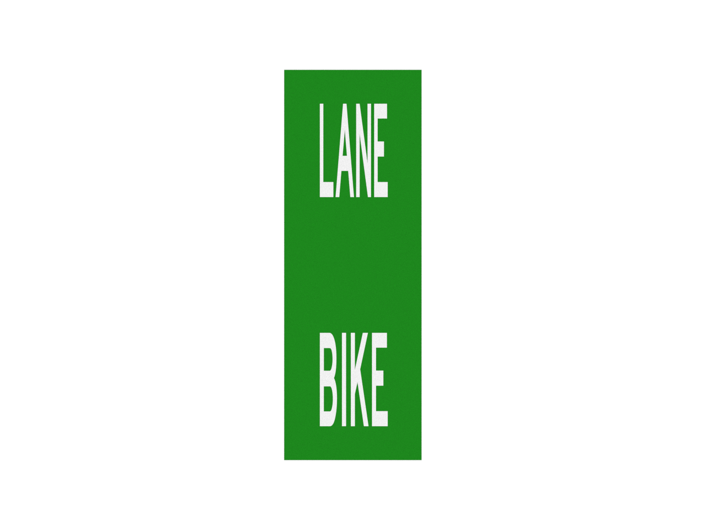

# Bike Lane

Urban asset for bike lane applications in city planning and simulation.

## Preview


*Additional views:*



## Specifications

- **Scale**: 1:48 (HO Scale)
- **Material**: Designed for PLA/PETG 3D printing
- **Print Time**: Varies by complexity
- **Support Required**: Minimal (model optimized for printing)

## Files Available

| File | Format | Description |
|------|---------|-------------|
| `scale bike lane marking 1 text only.stl` | STL | 3D printable mesh file |
| `scale bike lane marking 1.stl` | STL | 3D printable mesh file |
| `scale bike lane marking 2 decal only.stl` | STL | 3D printable mesh file |
| `scale bike lane marking 2.stl` | STL | 3D printable mesh file |
| `scale bike lane marking text only.stl` | STL | 3D printable mesh file |
| `scale bike lane marking.stl` | STL | 3D printable mesh file |
| `scale bike lane marking 1 text only.stp` | STP | CAD file for editing |
| `scale bike lane marking 1.stp` | STP | CAD file for editing |
| `scale bike lane marking 2 decal only.stp` | STP | CAD file for editing |
| `scale bike lane marking 2.stp` | STP | CAD file for editing |
| `scale bike lane marking text only.stp` | STP | CAD file for editing |
| `scale bike lane marking.stp` | STP | CAD file for editing |
| `scale bike lane marking 1.png` | PNG | Preview image |
| `scale bike lane marking 2.png` | PNG | Preview image |
| `scale bike lane marking.png` | PNG | Preview image |

## Usage

### 3D Printing
- **Layer Height**: 0.2mm (0.15mm for fine details)
- **Infill**: 15-20% (adjust based on use case)
- **Print Speed**: 50-60 mm/s
- **Supports**: Usually not required

### Applications
- Urban planning models
- Architectural visualizations
- City planning presentations
- 3D printed scale models
- Digital twin development
- Smart city research

## Download

- [Download STL file](scale bike lane marking 1 text only.stl)
- [Download STL file](scale bike lane marking 1.stl)
- [Download STL file](scale bike lane marking 2 decal only.stl)
- [Download STL file](scale bike lane marking 2.stl)
- [Download STL file](scale bike lane marking text only.stl)
- [Download STL file](scale bike lane marking.stl)
- [Download STP file](scale bike lane marking 1 text only.stp)
- [Download STP file](scale bike lane marking 1.stp)
- [Download STP file](scale bike lane marking 2 decal only.stp)
- [Download STP file](scale bike lane marking 2.stp)
- [Download STP file](scale bike lane marking text only.stp)
- [Download STP file](scale bike lane marking.stp)

## Attribution

When using this asset, please cite:
```
Author: Henry Levesque
Source: Urban Asset Library - Bike Lane
URL: https://github.com/hleve/Urban_Asset_Library
```

## Related Assets

- [All Urban Assets](../)
---

*Part of the [Urban Asset Library](../../../) - Open source urban assets for simulation and 3D printing*