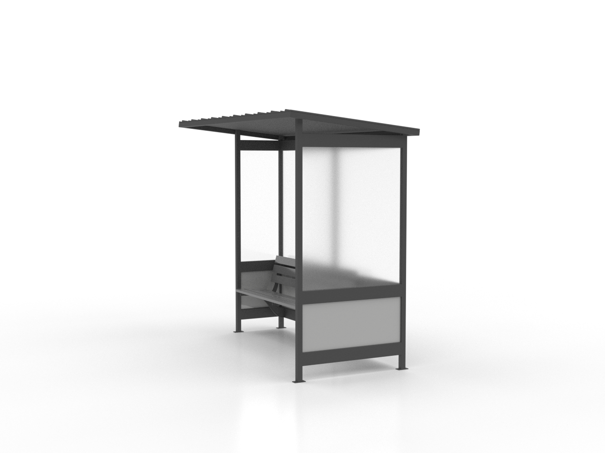

# Bus Stop

Public transit infrastructure for passenger boarding areas.

## Preview



*Additional views:*


## Specifications

- **Scale**: 1:48 (HO Scale)
- **Material**: Designed for PLA/PETG 3D printing
- **Print Time**: Varies by complexity
- **Support Required**: Minimal (model optimized for printing)

## Files Available

| File | Format | Description |
|------|---------|-------------|
| `bus stop bench only.stl` | STL | 3D printable mesh file |
| `bus stop frame only.stl` | STL | 3D printable mesh file |
| `bus stop glass only.stl` | STL | 3D printable mesh file |
| `bus stop roof only.stl` | STL | 3D printable mesh file |
| `bus stop.stl` | STL | 3D printable mesh file |
| `bus stop 1.png` | PNG | Preview image |
| `bus stop.png` | PNG | Preview image |

## Usage

### 3D Printing
- **Layer Height**: 0.2mm (0.15mm for fine details)
- **Infill**: 15-20% (adjust based on use case)
- **Print Speed**: 50-60 mm/s
- **Supports**: Usually not required

### Applications
- Urban planning models
- Architectural visualizations
- City planning presentations
- 3D printed scale models
- Public transit planning
- Passenger flow analysis
- Transit system design

## Download

- [Download STL file](bus stop bench only.stl)
- [Download STL file](bus stop frame only.stl)
- [Download STL file](bus stop glass only.stl)
- [Download STL file](bus stop roof only.stl)
- [Download STL file](bus stop.stl)

## Attribution

When using this asset, please cite:
```
Author: Henry Levesque
Source: Urban Asset Library - Bus Stop
URL: https://github.com/hleve/Urban_Asset_Library
```

## Related Assets

- [All Urban Assets](../)
---

*Part of the [Urban Asset Library](../../../) - Open source urban assets for simulation and 3D printing*